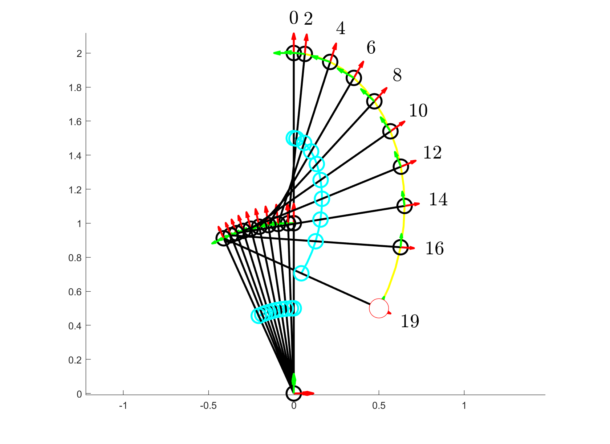

# What does this contain?

- Contains wrapper functions for CasADi objects, allowing you to quickly generate optimal control trajectories for planar robots with revolute joints. You can modify the `make_ndof_model` function to generate your optimal control problems.
- Will contain wrapper functions allowing you to quickly formulate and solve single-level inverse optimal control problems for planar robots with revolute joints.

The goal of the optimal control problem is to find the (discretized) joint angles:

$$ q = \begin{bmatrix} q_0 & q_1 & \ldots & q_{N-1} \end{bmatrix} $$

joint velocities:

$$ \dot{q} = \begin{bmatrix} \dot{q}_0 & \dot{q}_{1} & \ldots & \dot{q}_{N-2} \end{bmatrix} $$

and joint accelerations

$$ \ddot{q} = \begin{bmatrix} \ddot{q}_0 & \ddot{q}_{1} & \ldots & \ddot{q}_{N-3} \end{bmatrix} $$

that satisfy Euler integration constraints:

$$ q_{t+1} = q_t + \Delta t \, \dot{q}_t $$

$$ \dot{q}_{t+1} = \dot{q}_t + \Delta t \, \ddot{q}_t $$

## Example 1: Minimum joint velocity trajectory
The initial configuration is:

$$ q_0 = \begin{bmatrix} -\frac{\pi}{2} \\ 0 \end{bmatrix} $$

The end-effector final required position is:

$$ p_e = \begin{bmatrix} 0.5 \\ 0.5 \end{bmatrix} $$

The figure below shows a minimum joint velocity trajectory plotted. Explicitly the objective function is:

$$ \sum_{t=0}^{N-2} \dot{q}_t^T \dot{q}_t $$

## Example 2: Minimum joint torque trajectory
The initial configuration is:

$$ q_0 = \begin{bmatrix} -\frac{\pi}{2} \\ 0 \end{bmatrix} $$

The end-effector final required position is:

$$ p_e = \begin{bmatrix} 0.5 \\ 0.5 \end{bmatrix} $$

The figure below shows a minimum joint torque trajectory plotted. Explicitly the objective function is:

$$ \sum_{t=0}^{N-3} \tau_t^T \tau_t $$

Where the torque is computed using RNEA, but is explicitly equal to:

$$ \tau_t = M(q_t) \ddot{q}_t + C(q_t, \dot{q}_t) + G(q_t) $$

# Dependencies and Credits

## CasADi
All main scripts use CasADi. Get CasADi from [their website](https://web.casadi.org/get/) and add it to your path.

**Credit**:  
Andersson, J.A.E., Gillis, J., Horn, G., Rawlings, J.B., & Diehl, M., 2019. CasADi – A software framework for nonlinear optimization and optimal control. *Mathematical Programming Computation*, 11(1), pp.1-36. Available at: [https://doi.org/10.1007/s12532-018-0139-4](https://doi.org/10.1007/s12532-018-0139-4).

## TileFigures, SpreadFigures
Some scripts use the TileFigures function. Get it from [MATLAB Central File Exchange](https://www.mathworks.com/matlabcentral/fileexchange/70095-tilefigures-spreadfigures) and add it to your path.

**Credit**:  
Schreiber, E., 2024. TileFigures; SpreadFigures; MATLAB Central File Exchange. Available at: [https://www.mathworks.com/matlabcentral/fileexchange/70095-tilefigures-spreadfigures](https://www.mathworks.com/matlabcentral/fileexchange/70095-tilefigures-spreadfigures).
